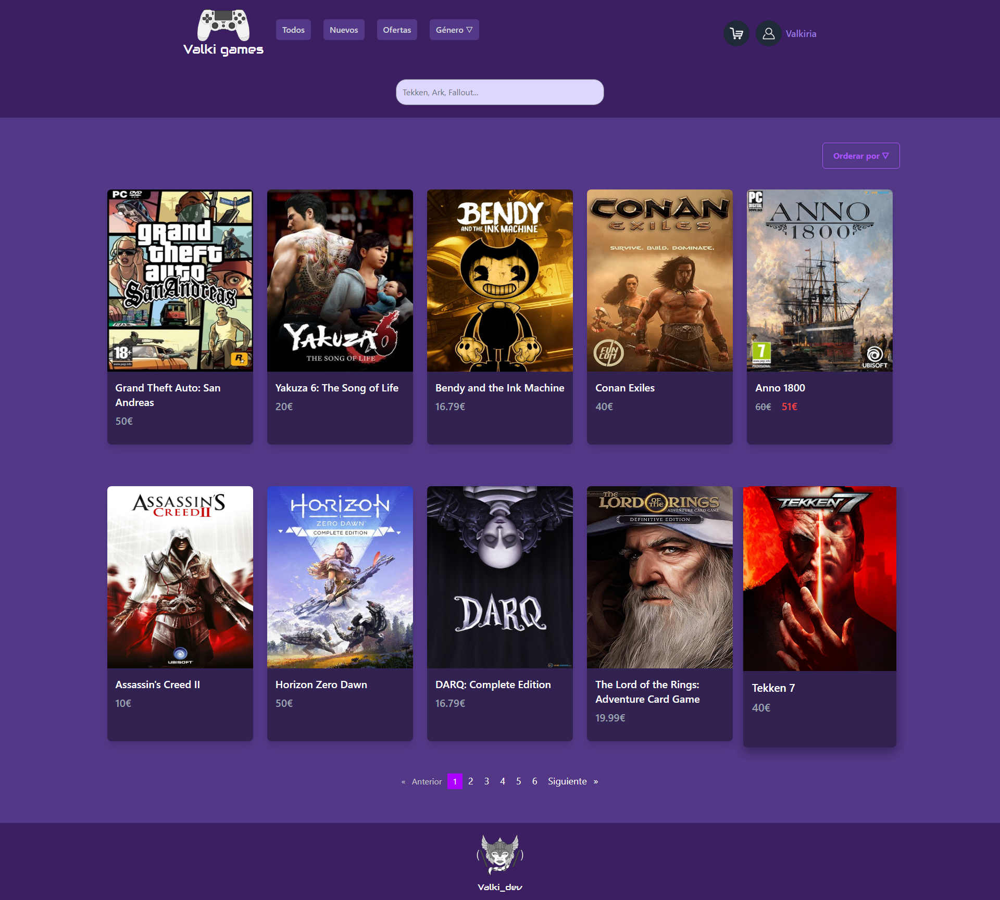

# Valki-games

Este proyecto ha sido generado con [Angular CLI](https://github.com/angular/angular-cli) version 14.2.7.

Para asegurarnos de que no haya ningún problema de compatibilidad, se recomienda trabajar y/o tener intalada la misma versión de Angular.

## Preparar el proyecto
Comenzaremos ejecutando el comando `npm install`, que instalará todas las dependencias de nuestro "package.json", necesarias para el buen funcionamiento del proyecto.

## Ejecutar el proyecto
Podemos ejecutar el proyecto de dos formas:
- Utilizando el comando `ng serve`, que ejecuta el programa, pero debemos abrir la web manualmente.
- Utilizando el comando `ng serve -o`, que ejecuta el programa y abre la web en cuanto este haya cargado

## PrimeNG
Para instalar PrimeNG se utiliza el comando `npm install primeng`.

Se pueden producir problemas de compatibilidad entre la versión de PrimeNG y nuestra versión de Angular. Para evitarlo, utlizaremos el comandode instalación de PrimeNG con la bandera "--force": `npm install primeng --force`

